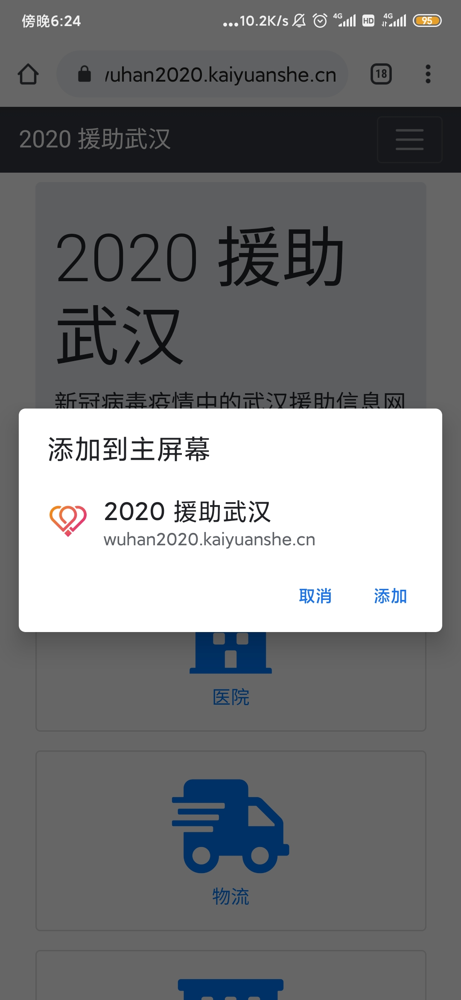
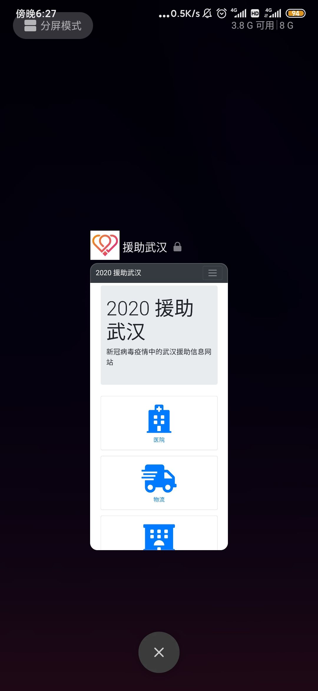

# 新冠战疫信息平台

武汉新型冠状病毒防疫信息平台（[渐进式 Web 应用][1]项目）

简体中文 | [English](./README_EN.md)

[][2]

[][3]
[][4]

## 基本用法

谷歌 Chrome、谋智 Firefox、欧朋、微软 Edge、UC 浏览器、小米浏览器、QQ 浏览器等均可**安装本网站到桌面**（Safari 对 [W3C 国际标准][5]支持迟缓，只能添加图标，**网络缓存**、**离线启动**等高级功能可能无法使用）







## 技术栈

-   逻辑语言: [TypeScript v5][6]
-   组件引擎: [WebCell v3][7]
-   组件库: [BootCell v2][8]
-   状态管理: [MobX v6][9]
-   PWA 框架: [Workbox v7][10]
-   打包工具: [Parcel v2][11]
-   CI / CD: GitHub [Actions][12] + [Pages][13]

## 开发需求

-   任务看板：https://github.com/orgs/wuhan2020/projects/1?fullscreen=true

-   UI 设计：正在赶制，参与开发的先参照现有页面

## 本地开发

### 连接线上测试服务器

1. [安装 Node.js](https://nodejs.org/en/download/package-manager/)

2. 安装 [PNPM](https://pnpm.io/zh/)

    ```shell
    npm i pnpm -g
    ```

3. `git clone https://github.com/wuhan2020/WebApp.git`

4. 在本项目文件夹中执行命令

    ```shell
    pnpm i
    npm start
    ```

（Windows 用户请在 [PowerShell 5.1+][14]、[Git Bash][15] 或 [WSL][16] 中运行）

### 连接本地测试服务器

1. 安装、启动[后端项目](https://github.com/wuhan2020/rest-api)

2. `pnpm start:local`

## 特别感谢

### 代码贡献者

https://github.com/wuhan2020/WebApp/graphs/contributors

### 域名贡献者

[开源社][17] 提供国内备案域名 https://wuhan2020.kaiyuanshe.cn/ ，以解决[国内应用软件内分享时的障碍][18]。

### 疫情数据提供方

特别感谢以下同学提供了来自丁香园的疫情数据：

-   [@hack-fang](https://github.com/hack-fang/nCov/blob/master/API.md)

-   [@BlankerL](https://github.com/BlankerL/DXY-2019-nCoV-Crawler)

[1]: https://developers.google.cn/web/progressive-web-apps
[2]: https://gitpod.io/?autostart=true#https://github.com/wuhan2020/WebApp
[3]: https://github.com/wuhan2020/WebApp/actions/workflows/main.yml
[4]: https://app.slack.com/client/TT5U1VCPQ/CSTPXN533
[5]: https://www.w3.org/
[6]: https://typescriptlang.org
[7]: https://web-cell.dev/
[8]: https://web-cell.dev/BootCell/
[9]: https://mobx.js.org
[10]: https://developers.google.com/web/tools/workbox
[11]: https://parceljs.org
[12]: https://github.com/features/actions
[13]: https://pages.github.com/
[14]: https://docs.microsoft.com/zh-cn/powershell/scripting/learn/using-familiar-command-names?view=powershell-5.1
[15]: https://gitforwindows.org/#bash
[16]: https://docs.microsoft.com/en-us/windows/wsl/install-win10
[17]: https://kaiyuanshe.cn/
[18]: https://github.com/wuhan2020/WebApp/issues/21
