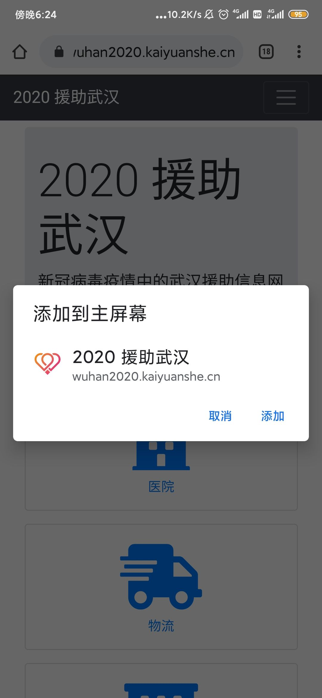

# New crown war epidemic information platform

Wuhan new coronavirus epidemic prevention information platform [Progressive Web Application][1] Project

[简体中文](./README.md) | English

[][2]

[][3]
[][4]

## Basics

Almost all the mainstream web browsers like Chrome, Firefox, Opera, Edge, UC, Xiaomi, QQ are compatible with the website ( Nota Bene : Safari supports [W3C][5] and help with the lagging issues. Icon insertion is supported but some advanced features like caching and off-line mode may not be functioning at this moment )





## Tech stack

-   Programming language : [TypeScript v5][6]
-   Engine : [WebCell v3][7]
-   Library : [BootCell v2][8]
-   State management : [MobX v6][9]
-   PWA framework : [Workbox v7][10]
-   Packaging tool : [Parcel v2][11]
-   CI / CD: GitHub [Actions][12] + [Pages][13]

## Development needs

-   Task dashboard ：https://github.com/orgs/wuhan2020/projects/1?fullscreen=true

-   UI design ：in progress. Developers: please refer to the current website.

## Native development

1. [Install Node.js](https://nodejs.org/en/download/package-manager/)

2. Install [PNPM](https://pnpm.io/zh/)

    ```shell
    npm i pnpm -g
    ```

3. `git clone https://github.com/wuhan2020/WebApp.git`

4. Run the commands in the directory of this project

    ```shell
    pnpm i
    npm start
    ```

（Windows users please run in [PowerShell 5.1+][14]、[Git Bash][15] or [WSL][16]）

### Connect to local test server

1. Install and start [rest-api](https://github.com/wuhan2020/rest-api)

2. `pnpm start:local`

## Thanks

### Code contributor

https://github.com/wuhan2020/WebApp/graphs/contributors

### Domain contributor

[Kaiyuanshe][17] provide domestic filed domain names https://wuhan2020.kaiyuanshe.cn/ , In order to solve the [obstacles when sharing in domestic application software][18].

### Outbreak data provider

Special thanks to the following students for providing the epidemic data from Lilac Garden :

-   [@hack-fang](https://github.com/hack-fang/nCov/blob/master/API.md)

-   [@BlankerL](https://github.com/BlankerL/DXY-2019-nCoV-Crawler)

[1]: https://developers.google.cn/web/progressive-web-apps
[2]: https://gitpod.io/?autostart=true#https://github.com/wuhan2020/WebApp
[3]: https://github.com/wuhan2020/WebApp/actions/workflows/main.yml
[4]: https://app.slack.com/client/TT5U1VCPQ/CSTPXN533
[5]: https://www.w3.org/
[6]: https://typescriptlang.org
[7]: https://web-cell.dev/
[8]: https://web-cell.dev/BootCell/
[9]: https://mobx.js.org
[10]: https://developers.google.com/web/tools/workbox
[11]: https://parceljs.org
[12]: https://github.com/features/actions
[13]: https://pages.github.com/
[14]: https://docs.microsoft.com/zh-cn/powershell/scripting/learn/using-familiar-command-names?view=powershell-5.1
[15]: https://gitforwindows.org/#bash
[16]: https://docs.microsoft.com/en-us/windows/wsl/install-win10
[17]: https://kaiyuanshe.cn/
[18]: https://github.com/wuhan2020/WebApp/issues/21
